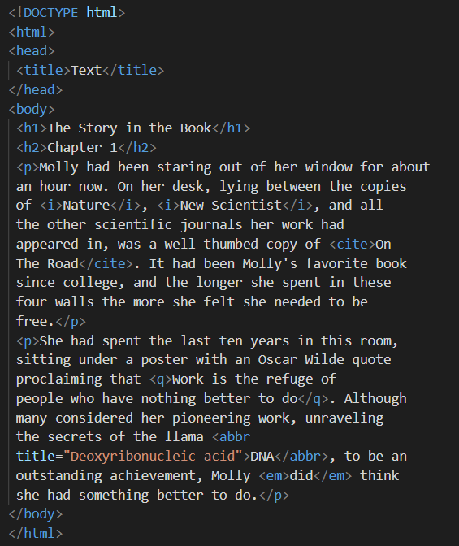

# HTML 

HTML stands for hyperlink-text markup languge. It is used to build the **stucture** of the website. We will start talking about the basic tags and elements through the language:

### Headings
If you need to use Headings in your websites, You can use Heading tags `<h#>Bla Bla Bla</h#>` and # can be (1-6). h1 declares the most important text and h6 the least important. 

### More tags
`
` tag can be used to insert a paragraph in the website. 
`<b>` To make the text bold and `<i>` make characters appear italic.
` & ` stands for superscript and subsript respectively. `` is mainly used in chemical formulas and `` for mathmatical concepts. 

## Why adding white spaces?

To make the website more readable ad comfort to the eye, **white spaces** are added using `  and 
` tags. 
` ` move the text in a new line. `
` to create a break between themes. 

in order to remove any editings come from word processers, copy the wanted text, paste it in a plain text editor and the copy it and paste again in the visual editor. 

### Semantic Markup

Semantic Markup includes the tags that have a meaning and does not affect the structure of fthe website directly, but to add more information to the wanted page. 

`<dfn>` is used to to **define** a new word for the first time in the website. Some browsers show it as italic text and some don't. 

To conclude the contact details of the author of the page, `<adress>` tag is used! And like `<dfn>` tag, some browsers show it as italic text and some don't. 

To make the text writing in the website more related to the content,`<ins> & <del>` tags are used. The `<ins>` element can be used  to show content that has been  inserted into a document, while the `<del>` element can show text that has been deleted from it.

From duckett book, here is an example to illustate the above tags: 

# CSS 

CSS is used to design the structure of the website will look like. We can style boxes appearance (width and Height, borders, background color, and postioning the browser window), text appearance (size, color, bold, italic...) and more specific elements. 

## How to write css code?

1. External CSS and then to link the css file with the html, we use <link> as illustrated bellow: 
<link href="css/styles.css" type="text/css" 
 rel="stylesheet" />

2. internal CSS
writing the code in <style> tag that is inserted in the head of the html. 

3. Inline CSS
It is written withen the body of the html file. 

If there is more than one element that have the same type, and you want to specilize one of them with some properaties, we use id. In the other hand, if there are a group that is wanted to have the same proparities, we use class. 

# JavaScript

JS code is called a script. A script is a series of instructions that a computer can follow one-by-one.  Each individual instruction or step is known as a statement. Statements should end with a semicolon.

Also to illustate your work, you can make some notes to help you progress your work. And there are 2 ways to wrie comments: 
1. Single line comment using `//` 
2. Multi-line comment using `/* Your comment */`

## How can we store our data?
Using variables. We can store within them (strings, boolean, numbers..). Note that the value inside them can bechanged as we walk through the script. 

### To declare variables 
` var quentityName; `. It's is possible to give a value through the decleration ` var quentityName = value; `

**YOU CAN NOT use** (-), (.), number at the beginning, or reserved keywords in naming the variables. 

Arrays 
Arrays are helpful when dealing with a list or set of values that are related togather. Firt of all, you can name arrays like we name the variables.

To declare the array, here is the syntax: 
`var arrayName = new Array ('element1', 'element2', 'element3'....)`

Also you can have an overview for [loops](/home/bayan_hmaidy/projects/reading-notes/Loops.md). 

