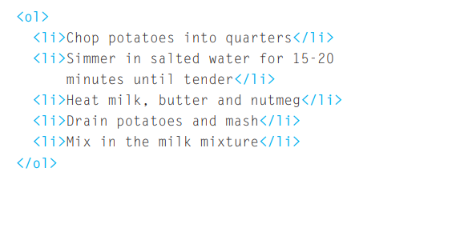
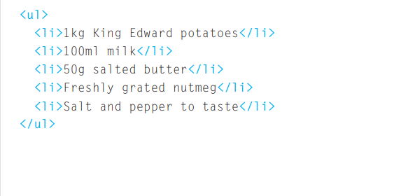
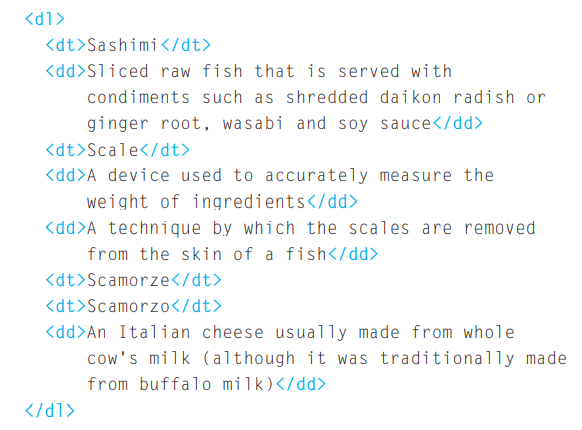

# Lists 

In website buildings, the need of list usage appears in the types of lists we have. There are 3 types of lists (and we will walk through their details):
1. Ordered Lists. `<ol>`
2. Unordered Lists. `<ul>`
3. Defintion Lists.

### Ordered Lists 
It is used to lists that must contain the rder of the items included in it. Look through the example provided 
 

to create the ordered list we use `<ol>` tag and every item of the list is placed between `<li>` tag 

## Unordered List
It is used when items numbering isn't that muchh benefit, or when the order is not looked for. to create the unordered list we use `<ul>` tag and every item of the list is placed between `<li>` tag. Look at the example bellow 

## Definition Lists

This method is usful when you have a set of defintions and want to list them neither in (ol) or (ul) methods. Here is an example and illlustration is provided below

`<dl>` 
The definition list is created with the `<dl>` element and usually consists of a series of terms and their definitions. Inside the `<dl>` element you will usually see pairs of `<dt>` and `<dd>` elements.

`<dt>`
This is used to contain the term being defined (the definition term).

`<dd>`
This is used to contain the definition. Sometimes you might see a list where there are two terms used for the same definition or two different definitions for the same term.

## Box Dimensions
In deafult settings of the browser, boxes are sized to be big enough to hold their components. Height and width propeties are the dimensions of any box. In order to specify the size of the box, pixels, percentages, or 
ems are used. 

## Limiting width (min-width, max-width)

Some page designs expand and shrink to fit the size of the user's screen. In such designs, the min-width property specifies the smallest size a box can be displayed at when the browser window is narrow, and the max-width property indicates the maximum width a box can stretch to when the browser window is wide.

## Limiting height (min-height, max-height)

In the same way that you might want to limit the width of a box on a page, you may also want to limit the height of it. This is achieved using the min-height and max-height properties. 

**Note:** If the box is not big enough to hold the content, and the content expands outside the box it can look very messy. To control what happens when there is not enough space for the content of a box, you can use the overflow
property, which is discussed on the next page.

## Overflow

The overflow property tells the browser what to do if the content contained within a box is larger than the box itself. It can have one of two values:

hidden: This property simply hides any 
extra content that does not fit in 
the box.
scroll: This property adds a scrollbar to 
the box so that users can scroll 
to see the missing content.

### Border 
Every box has borders even if it's not visible. 
Borders could be contolled by it's width, style, or color. Notify that border is a shortand property (widh, style and color can be specified once) 

## Margin 

It locates outside the border's edge. Spaces between items on the page are called white spaces. 

## Padding 
Padding is the space between the border of a box and any content contained within it. Adding padding can increase the readability of its contents.

## Centering content

If you want to center a box on the page (or center it inside the element that it sits in), you 
can set the left-margin and right-margin to auto. In order to center a box on the page, you need to set a width for the box (otherwise it will take up the full width of the page).

# Arrays 

Arrays is used to store number of variables that could be string, numbers or bolean. Arrays are usefull when you don't know the **exactly** number of items. 

#### Arrays Syntax:
`var arrayName;
arrayName = [element1, element2, element3, ...]`

Each item in an array is automatically given a number called an index. This can be used 
to access specific items in the array. Note that index started at **0 not 1.**

## Switch statements 
A switch statement starts with a variable called the switch value. Each case indicates a possible 
value for this variable and the code that should run if the variable matches that value. Each case ends with the break keyword which will tell the JavaScript interpreter to skip the rest of this code block and continue onto the next.